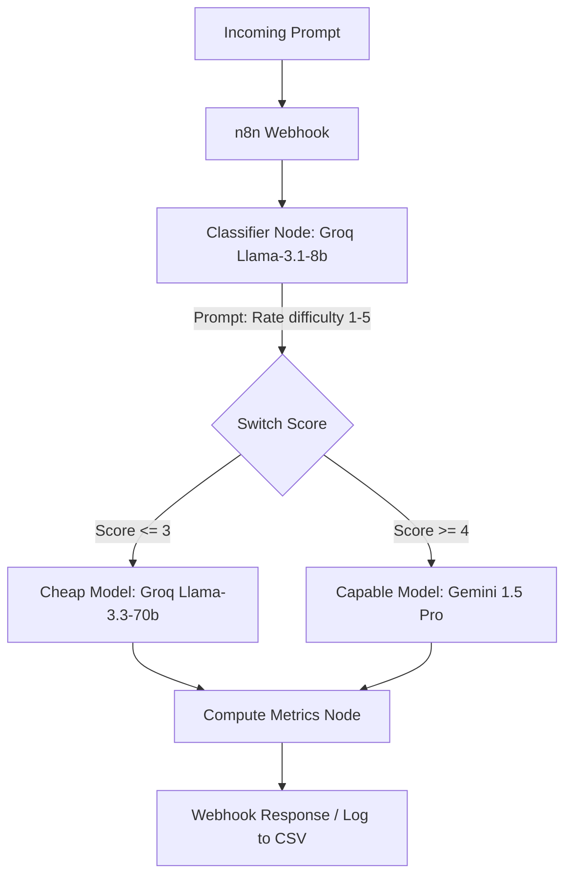

# RouteDemo: Cost-Aware Multi-Agent LLM Router

RouteDemo is a portfolio-grade demonstration project that implements an n8n-orchestrated multi-agent pipeline. It routes prompts to either a fast/cheap LLM (e.g., Llama 3 on Groq) or a capable/expensive LLM (e.g., Gemini 1.5 Pro) based on estimated task difficulty. The goal is to produce real, computed, auditable metrics (cost, latency, accuracy) comparing the routed execution against an "always-use-the-expensive-model" baseline.

## Prior Art & Honest Framing

**Note:** This project is a reproduction and validation of an established industry pattern. It is not a claim of novel research. 
The architecture draws direct inspiration from frameworks like:
*   [LMSYS RouteLLM](https://github.com/lm-sys/RouteLLM)
*   [RouterBench](https://arxiv.org/abs/2403.12031)
*   "Adaptive" or "Cost-Aware" router models (e.g., in Devin/Windsurf).

Instead of a trained routing model, this project demonstrates a highly practical, prompted classifier approach using standard open-source tools (n8n).

## Architecture

The pipeline consists of a simple webhook trigger and a difficulty classifier, followed by a switch node to split the traffic.



## Setup & Running

1. **Environment Setup:**
   ```bash
   cp .env.example .env
   # Add your GROQ_API_KEY and GEMINI_API_KEY
   python3 -m venv .venv
   source .venv/bin/activate
   pip install -r requirements.txt
   ```

2. **Run the Baseline:**
   ```bash
   python scripts/run_baseline.py
   ```

3. **Start n8n (Docker):**
   ```bash
   docker compose up -d
   ```
   *Import the workflow from `n8n/route_demo.json` into your n8n instance and activate the webhook.*

4. **Run the Routed Pipeline:**
   ```bash
   python scripts/run_routed.py
   ```

5. **Generate Metrics:**
   ```bash
   python scripts/compute_metrics.py
   ```
   *View results in `results/comparison_table.md` and `results/comparison_chart.png`.*
