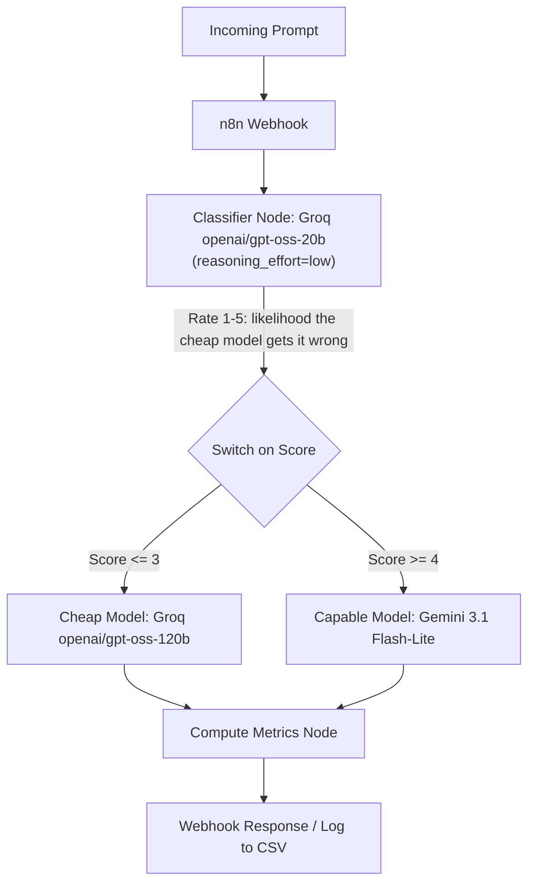

# RouteDemo: Cost-Aware Multi-Agent LLM Router

RouteDemo is a portfolio-grade demonstration project that implements an n8n-orchestrated multi-agent pipeline. It routes prompts to either a fast/cheap LLM (Groq `openai/gpt-oss-120b`) or a capable LLM (Google `gemini-3.1-flash-lite`) based on a difficulty score from a separate lightweight classifier call. It produces real, computed, auditable metrics (cost, latency, accuracy) comparing the routed execution against an "always-use-the-capable-model" baseline, logged from actual API calls with no fabricated or estimated numbers.

## Prior Art & Honest Framing

**Note:** This project is a reproduction and validation of an established industry pattern. It is not a claim of novel research.
The architecture draws direct inspiration from:
*   [LMSYS RouteLLM](https://github.com/lm-sys/RouteLLM)
*   [RouterBench](https://arxiv.org/abs/2403.12031)
*   "Adaptive" / cost-aware router patterns used in products like Devin and Windsurf.

Instead of a trained routing model, this project uses a prompted-classifier approach (a small LLM rating difficulty 1-5) with standard, self-hostable tooling (n8n) — deliberately simple, not novel.

## Architecture



## Results

Run on the full 150-prompt eval set (75 GSM8K + 75 MMLU), real logged API calls, no estimated numbers:

| Metric | Baseline (Capable Only) | Routed (Adaptive) |
| --- | --- | --- |
| Total Cost ($) | 0.0241 | 0.0286 |
| Accuracy (%) | 88.67 | 89.33 |
| Average Latency (ms) | 3570.6 | 1805.5 |
| Capable Model Calls | 150 | 6 |
| Cheap Model Calls | 0 | 144 |

See `results/comparison_chart.png` for the visual comparison.

### Honest finding: routing won on latency and accuracy, not on raw dollar cost

The classifier correctly discriminates on genuinely hard prompts (it rates open-research-problem-style questions 4-5, and did route 6/150 real eval prompts to the capable tier), but on this benchmark most GSM8K/MMLU questions are within reach of the 120B cheap-tier model, so 144/150 prompts stayed on the cheap tier. Latency dropped 49% and accuracy improved slightly, since the classifier + cheap tier round-trip is still faster in aggregate than always paying the larger model's response time. But total dollar cost came out slightly *higher* for the routed pipeline than the baseline — not because the cheap tier is priced higher (it isn't: $0.15/$0.60 per 1M tokens vs. Gemini's $0.25/$1.50), but because the cheap Groq model answers roughly 2.5x more verbosely per response (avg 229 output tokens vs. Gemini's 91) with no instruction to be concise on either side. This is a real, unmodified finding: **routing savings are gated by response verbosity, not just by per-token price** — a distinction that's easy to miss and worth stress-testing before trusting a router's cost claims in production.

## Setup & Running

1. **Environment Setup:**
   ```bash
   cp .env.example .env
   # Add your GROQ_API_KEY and GEMINI_API_KEY
   python3 -m venv .venv
   source .venv/bin/activate
   pip install -r requirements.txt
   ```

2. **Prepare the eval set:**
   ```bash
   python scripts/prepare_dataset.py
   ```

3. **Run the baseline (always-capable-model):**
   ```bash
   python scripts/run_baseline.py
   ```

4. **Start n8n (Docker) and activate the workflow:**
   ```bash
   docker compose up -d
   ```
   Import `n8n/route_demo.json` into the n8n editor at `http://localhost:5678` and publish/activate it so its webhook is live.

5. **Run the routed pipeline:**
   ```bash
   python scripts/run_routed.py
   ```

6. **Generate the comparison metrics:**
   ```bash
   python scripts/compute_metrics.py
   ```
   View `results/comparison_table.md` and `results/comparison_chart.png`.

Set `TEST_MODE=true` before either runner script to process only the first 5 prompts, useful for a fast sanity check before committing to a full 150-prompt run.

## Tech Stack

- **Orchestration:** n8n (self-hosted, Docker, Community Edition)
- **Models:** Groq (`openai/gpt-oss-20b` classifier, `openai/gpt-oss-120b` cheap tier), Google Gemini (`gemini-3.1-flash-lite` capable tier)
- **Data & analysis:** Python 3.11+, HuggingFace `datasets` (GSM8K + MMLU), pandas, matplotlib
- **Logging:** flat CSV/JSONL files, no database
- **Secrets:** `.env` (gitignored), see `.env.example` for required keys

## Non-Goals (v1)

No Postgres/Redis, no cloud deployment automation, no trained router model, no UI beyond n8n's editor and the results chart/table. See `DEMO_SCRIPT.md` for the video walkthrough storyboard.

## v2: Calibrated Cost-Aware LLM Router

This repo also contains a production-grade follow-up in [`v2/`](v2/) that replaces v1's prompted "rate 1-5" classifier with a genuinely calibrated statistics model (logistic regression, checked for calibration honesty via ECE/Brier, not just accuracy), served by a real FastAPI service (not n8n) with Postgres logging, Redis caching, retries + a circuit breaker on every provider call, Prometheus/Grafana observability, and a live interactive demo page.

On a held-out 50-prompt evaluation, the calibrated router improves accuracy by 4 percentage points over always using the top-tier model while cutting cost by 93.9% — see [`v2/CASE_STUDY.md`](v2/CASE_STUDY.md) for the full architecture, the real bugs found and fixed along the way, and the honest limitations.
