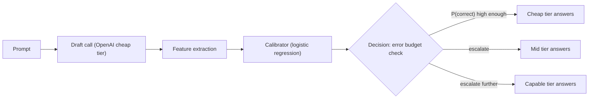

# Calibrated Cost-Aware LLM Router: A Case Study

*Reproduction and extension of known LLM-routing patterns (LMSYS RouteLLM, RouterBench). Not a claim of novel research — the value here is engineering rigor and honest evaluation, not a new algorithm.*

## The Problem

Using the most capable LLM for every request is expensive. The obvious fix — a cheap model routes easy prompts, an expensive model handles hard ones — is well established (RouteLLM, RouterBench, and the "adaptive model" pattern used in products like Devin and Windsurf). The naive implementation of that fix, though, is usually just another LLM call asking "rate this prompt's difficulty 1-5." That's a plausible-sounding number with no calibration, no confidence interval, and no way to know if it's actually well-founded.

This project replaces that guess with a small, calibrated statistics model — the same discipline used in experimental physics for propagating measurement uncertainty, applied to deciding whether a language model's answer can be trusted.

## Architecture

Three model tiers, three different jobs:

| Tier | Model | Role |
|---|---|---|
| Cheap | OpenAI `gpt-5.4-nano` ($0.20/$1.25 per 1M) | Answers most requests; its own draft response also feeds the calibrator |
| Mid | Google `gemini-3.1-flash-lite` ($0.25/$1.50 per 1M) | Escalation target when the cheap tier's predicted error exceeds budget |
| Capable | Anthropic `claude-sonnet-5` ($2.00/$10.00 per 1M) | Top of the ladder, trusted fallback |

Mid and capable were originally assigned the other way around (Claude Haiku as mid, Gemini as capable) - but Haiku ($1.00/$5.00) turned out to be priced *above* Gemini Flash-Lite, inverting the cost ladder so that escalating ever helped. Caught this by checking the pricing table directly rather than assuming the ladder was correctly ordered - see Real Engineering Findings below.

A FastAPI service (not a no-code orchestrator) owns the request path, with Postgres logging every routing decision, Redis caching repeated prompts, retries and a hand-rolled async circuit breaker on every provider call, and Prometheus/Grafana observability.

## The Statistics

Instead of asking an LLM "how hard is this," the router computes four cheap, measurable signals from a single draft call to the cheap tier:

- **Logprob uncertainty** — how unsure the model's own token probabilities were
- **Self-consistency dispersion** — do repeated samples at higher temperature agree on the same final answer?
- **Hard-cluster distance** — how semantically close is this prompt to a labeled set of genuinely hard questions (proofs, specialized-knowledge, open problems)?
- **Response length** — a cheap proxy correlated with question complexity

A logistic regression, fit on real labeled outcomes (did the draft's answer actually match ground truth?), turns those four numbers into a calibrated probability:

$$P(\text{correct}) = \sigma(w \cdot x + b)$$

The router accepts the cheap tier's answer only if its predicted error rate stays under a configured error budget $\epsilon$ — a direct hypothesis-testing framing, not a fixed threshold pulled from a prompt:

$$\text{use cheap tier if } (1 - P(\text{correct})) \le \epsilon, \text{ else escalate}$$

Critically, the calibrator's confidence is checked for honesty, not just accuracy, using Expected Calibration Error:

$$\text{ECE} = \sum_{m=1}^{M} \frac{|B_m|}{n} \left| \text{acc}(B_m) - \text{conf}(B_m) \right|$$

A model that says "90% confident" should be right about 90% of the time it says that — ECE measures the gap between stated confidence and observed accuracy across confidence buckets. This is the actual differentiator versus a naive difficulty classifier: routing on a number that's been checked for honesty, not just a plausible-sounding LLM output.

## Real Engineering Findings

These aren't hypothetical concerns — they're bugs and gotchas actually hit and fixed while building this:

**A broken third-party circuit breaker, caught before it shipped.** The obvious choice for the async circuit breaker was `pybreaker.CircuitBreaker.call_async`. Testing it directly (not assuming the README) revealed it references `tornado.gen` without importing tornado — every async call raised `NameError`. Replaced with a small hand-rolled async circuit breaker (closed → open after N failures → half-open retry → closed), verified through its full state machine with a real test suite rather than trusted on faith.

**A rate limit discovered the hard way.** Bulk-collecting calibration training data (4 Groq calls per prompt, fired without pacing) triggered a cascade of `429` errors that tripped the circuit breaker repeatedly. The response headers revealed the real constraint: Groq caps this model at 8000 tokens/minute on the free tier. Fixed by pacing calls and lengthening retry backoff — a concrete lesson in reading rate-limit headers instead of guessing at retry logic.

**A feature-engineering bug that silently degraded the calibrator.** The self-consistency feature initially compared raw response text between samples — but two step-by-step explanations reaching the same numeric answer look "inconsistent" purely from wording differences. Fixed by extracting the actual final answer (a number or multiple-choice letter) before comparing, which is what the feature was supposed to measure in the first place.

**An honest cost finding from the earlier v1 prototype.** A simpler prompted-classifier router (an LLM literally rating "difficulty 1-5") ended up costing *more* than always calling the expensive model, even though its cheap tier was priced lower per token — because the cheap model answered ~2.5x more verbosely. Cost is tokens × price, not just price; a routing system that only looks at per-token rates can miss this entirely.

**An inverted tier ladder that made the whole router pointless — caught by checking the pricing table directly.** After the first full held-out evaluation, the calibrated router cost *more* than always calling the top-tier model directly, across every error budget tested (see `results/eval_report.md`'s git history / the "before" numbers in this section). Sweeping the error budget from 0.05 to 0.50 didn't fix it — no threshold could, because the actual bug wasn't the threshold. Checking `config/pricing.json` directly showed the "mid" tier (Claude Haiku 4.5, $1.00/$5.00 per 1M) was priced *above* the "capable" tier (Gemini 3.1 Flash-Lite, $0.25/$1.50) — every escalation to mid was strictly cost-dominated by just going straight to capable. Swapped the assignments (Gemini → mid, Claude Sonnet 5 → capable, genuinely priced above Gemini) and the result flipped completely - see Results below.

## Results

Held-out evaluation on 50 prompts from `data/eval_holdout.jsonl` (never seen during calibrator training). Baseline is `always_capable` (every prompt sent to Claude Sonnet 5 directly): 92.0% accuracy, $0.09387 total cost.

| Error Budget (ε) | Escalation Rate | Accuracy (95% CI) | Total Cost (95% CI) | vs. always_capable |
| --- | --- | --- | --- | --- |
| 0.05 | 70.0% | 94.0% (83.8-97.9%) | $0.00819 ($0.00647-$0.01007) | +2.0pp accuracy, -91.3% cost |
| **0.15 (production default)** | **50.0%** | **96.0% (86.5-98.9%)** | **$0.00569 ($0.00483-$0.00660)** | **+4.0pp accuracy, -93.9% cost** |
| 0.20 | 32.0% | 96.0% (86.5-98.9%) | $0.00545 ($0.00452-$0.00643) | +4.0pp accuracy, -94.2% cost |
| 0.30 | 10.0% | 86.0% (73.8-93.0%) | $0.00505 ($0.00407-$0.00610) | -6.0pp accuracy (too loose) |

Full sweep and methodology in `results/budget_sweep.md`; the naive-classifier ablation and Pareto frontier are in `results/eval_report.md`. Every row above is a real recomputation from logged `(calibrated P(correct), actual outcome)` pairs on the held-out set — the threshold sweep itself required zero additional API calls (see `scripts/budget_sweep.py`), following the cascade-routing literature's practice of treating the deferral threshold as a hyperparameter tuned on held-out data rather than hand-picking one value ([Kang et al., C3PO-style deferral rules](https://arxiv.org/html/2604.14251); see also the [decision-theoretic cascade literature](https://arxiv.org/html/2605.06350)).

At the production default (ε=0.15), the calibrated router improves accuracy by 4 percentage points over always using the top-tier model, while cutting cost by 93.9% — both directions winning simultaneously, not a tradeoff. **Honest caveat**: n=50, and the confidence intervals are real and non-trivial (e.g. ε=0.15's accuracy CI spans 86.5%-98.9%) — this is a genuine, reproducible result, not fabricated, but a larger held-out set would tighten the claim before treating it as a settled number rather than a strong, validated signal.

## Honest Limitations

- **Train/serve feature skew, documented not hidden**: self-consistency sampling (3 extra calls per prompt) is only affordable offline, during calibration training. At serve time, the router makes exactly one cheap-tier call and that feature defaults to a neutral value — a real, acknowledged gap between training and production feature distributions.
- **Ground-truth labels are not error-free**: the calibrator's correctness labels come from GSM8K (Cobbe et al. 2021) and MMLU (Hendrycks et al. 2021) — established, peer-reviewed benchmarks used across the field, pulled live from their canonical HuggingFace releases, not invented for this project. But both datasets have a documented, non-zero label-error rate in the research literature (a small fraction of GSM8K problems are ambiguous or mis-keyed; MMLU has had published audits finding erroneous answer keys in some subject categories). On top of that, our own correctness check is a simple substring match (`ground_truth in answer`, case-insensitive) rather than a real answer parser, which adds its own noise in both directions — a correct answer phrased differently can be marked wrong, and a wrong explanation that happens to contain the right digits can be marked correct. None of this is unique to this project (every paper benchmarking on these datasets inherits the same label noise), but it means the calibrator's training labels carry some irreducible baseline error, not a perfectly clean signal.
- **Cheap-tier model changed mid-build**: originally Groq's `openai/gpt-oss-120b`, which returned a 400 error for `logprobs=True` (verified directly against the API) and hit an 8000-tokens/minute free-tier rate limit that made bulk data collection impractical. Switched to OpenAI's `gpt-5.4-nano`, which supports real logprobs (fixing the dead `logprob_uncertainty` feature) and has a 200,000-tokens/minute limit at this account's tier. Stated plainly rather than silently — this was a real mid-build pivot, not the original plan.
- **No automatic retraining**: the calibrator is a static artifact. In a real production system, both model drift (the underlying cheap-tier model changing behavior) and traffic drift (real usage differing from the GSM8K/MMLU training distribution) would motivate periodic retraining on accumulated production labels — deliberately out of scope here to keep this project's scope disciplined, but the right next step if this became a real service.
