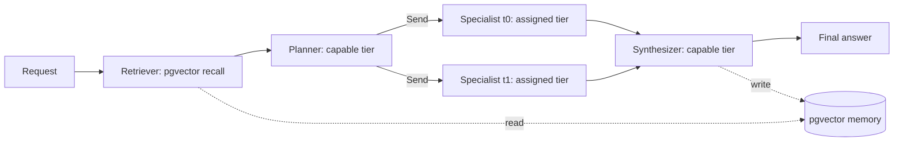

# Multi-agent context sharing

`POST /route/multi-agent` is a second code path alongside the single-call `/route`
endpoint (see the root [README](../README.md) for that one). It adds real multi-agent
collaboration: a planner decomposes a request, independent specialist agents work each
sub-task on the existing cost tiers, and a synthesizer combines their results - with
context genuinely shared between agents, not just three isolated calls happening to run
in the same process.

## Why this exists, and what it corrects

The repo's name says "Multi-Agent," but until this addition nothing in the code
actually had agents sharing context with each other - `/route` is a single linear
decision (draft → calibrate → maybe escalate). This doc and the `app/agents/` package
close that gap, and are deliberately honest about what was added versus what already
existed.

It's also a direct answer to a common framing mistake worth naming explicitly: **"MCP +
RAG" is not the industry-standard pattern for cross-agent context sharing.** MCP
standardizes agent↔tool/data access; RAG is a long-term-memory retrieval mechanism.
Neither handles the actual problem - live, moment-to-moment context handoff between
cooperating agents in one task. That's a separate, third thing: a structured shared-state
object (LangGraph state graphs, OpenAI Agents SDK context objects, A2A task/artifact
messages). This project builds two of the three real layers:

| Layer | What it's for | What this repo uses |
| --- | --- | --- |
| Live coordination | Moment-to-moment context handoff between agents in one run | LangGraph state graph (`app/agents/state.py`, `graph.py`) |
| Session memory | Recent verbatim turns of *this* conversation, so a follow-up like "minus 2 from that" resolves correctly | Redis, TTL'd, opt-in via `session_id` (`app/agents/session.py`) |
| Long-term memory | Facts that should persist and be recalled across separate sessions | pgvector on the existing Neon Postgres (`app/agents/memory.py`) |
| Tool access (MCP) | Standardized agent↔external-tool/data access | **Not built.** No external tool exists yet that needs it - see below |

A fourth row is worth naming precisely because it's easy to conflate with the third:
session memory and long-term memory solve different problems. Session memory is exact,
recent, and ephemeral - the actual last few turns, used so pronouns and references
resolve. Long-term memory is approximate, cross-session, and durable - a semantic-
similarity search over everything ever asked, used for topical recall. A real request
this design hit during testing: "minus 2 from that" right after "What is 15% of
240?" - resolving "that" needs the exact prior turn, not a similarity search, which is
why session memory exists as its own layer instead of just leaning harder on pgvector.

## Architecture



- **Retriever** (`app/agents/nodes/retriever.py`) runs first, pulls up to 3 relevant
  past request/answer pairs from `memory_entries` by cosine similarity.
- **Planner** (`nodes/planner.py`) calls the capable tier to decompose the request into
  1-3 sub-tasks, each assigned a tier (cheap/mid/capable) by the planner itself. Falls
  back to a single cheap-tier sub-task on any parse failure or provider error - same
  graceful-degradation stance as the embedder loader in `app/main.py`.
- **Specialists** (`nodes/specialist.py`) each run as an independent LangGraph node
  invocation via the `Send` API (`graph.py`'s `dispatch_specialists`) - genuine parallel
  fan-out, not one node looping over a list. Each writes only a condensed result
  (answer text, tier, cost, latency) into shared state, never its full raw provider
  response - the same "condensed results, not raw transcripts" pattern Anthropic
  describes in [their multi-agent research system writeup](https://www.anthropic.com/engineering/multi-agent-research-system).
- **Synthesizer** (`nodes/synthesizer.py`) combines sub-task answers into one final
  answer (skips the extra capable-tier call entirely when there's only one sub-task),
  then writes a summary back to `memory_entries` for future requests to recall.

### The shared context object

`app/agents/state.py`'s `AgentState` is the structured context object every node reads
and writes - this is the actual coordination mechanism, not MCP and not the vector
store. `results` uses a custom merge reducer so concurrent specialist writes combine
instead of clobbering each other; `trace` accumulates a human-readable log of what each
node did, returned in the API response as a lightweight audit trail.

### Run state persistence

Each run's LangGraph checkpoints are persisted via `AsyncPostgresSaver` against the
same Neon Postgres the rest of the service already uses (`app/main.py`'s `_lifespan`),
keyed by `thread_id` = the request id. If Postgres is unreachable at startup, the graph
still runs, just without durable/resumable state - logged, not fatal, matching every
other DB-optional code path in this service (`app/main.py`'s best-effort request
logging, `app/db.py`'s `pool_pre_ping`).

## Why MCP wasn't added

MCP solves standardized agent↔tool/external-data access. This project has no external
tool or data source an agent needs to reach through a standardized protocol yet - the
"tools" here are the three existing provider clients (`app/providers/`), already called
directly. Adding an MCP server/client around them now would be exactly the mistake
flagged elsewhere in this project's planning: a keyword added before the code earns it.
If a real external tool need shows up (e.g. a search API, a code execution sandbox), MCP
is the correct thing to reach for then, cleanly layered on top of the same `AgentState`
this design already has.

## Trying it

One-shot, stateless (default - no `session_id`):

```bash
curl -X POST http://localhost:8000/route/multi-agent \
  -H "Content-Type: application/json" \
  -d '{"prompt": "What is 12 * 7, and what is the capital of Portugal?"}'
```

Response includes the final synthesized answer, each sub-task's tier/model/cost, and a
trace of every node's contribution - e.g. `["retriever: found 0 relevant memory
entries", "planner: decomposed into 2 subtask(s): t0/cheap, t1/mid", "specialist t0:
cheap/gpt-5.4-nano answered (...)", "specialist t1: mid/gemini-3.1-flash-lite answered
(...)", "synthesizer: combined sub-task results into final answer"]`.

Conversational (opt in with a `session_id`, reused across turns):

```bash
curl -X POST http://localhost:8000/route/multi-agent \
  -H "Content-Type: application/json" \
  -d '{"prompt": "What is 15% of 240?", "session_id": "demo-1"}'

curl -X POST http://localhost:8000/route/multi-agent \
  -H "Content-Type: application/json" \
  -d '{"prompt": "minus 2 from that", "session_id": "demo-1"}'
```

The second call's planner sees the first turn's Q&A in its prompt and rewrites the
sub-task into self-contained text ("What is 36 minus 2?") before it ever reaches the
cheap tier - the cheap-tier specialist itself never sees "that" or any session state,
only the resolved prompt. This is stochastic (an LLM decomposition step, not a
guarantee) - it occasionally answers the literal sentence instead of resolving the
reference, same as any planner call in this design falling back gracefully rather than
failing outright.
