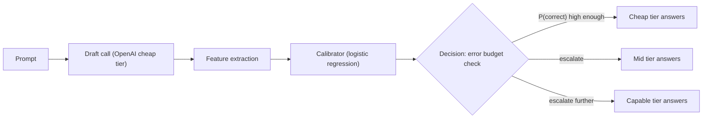

# Calibrated Cost-Aware LLM Router (v2)

**Live demo**: [calibrated-router-768949786238.us-central1.run.app](https://calibrated-router-768949786238.us-central1.run.app) (Cloud Run + Neon Postgres + Upstash Redis — first request after a cold start takes ~40s, warm requests run 2-3s)

A production-grade follow-up to [v1](../README.md). Instead of asking an LLM to guess a prompt's difficulty, a small logistic-regression calibrator (trained on real labeled outcomes, checked for calibration honesty via ECE/Brier — not just accuracy) predicts the probability that a cheap model's draft answer is correct, and the router only escalates to a pricier tier when that predicted error exceeds a configured budget. Served by a real FastAPI service — Postgres logging, Redis caching, retries and a circuit breaker on every provider call, Prometheus/Grafana observability — not a no-code orchestrator.

Full writeup, architecture, real engineering findings (including a broken third-party dependency caught before shipping, a rate-limit discovery, and a tier-pricing inversion that made the whole router pointless until fixed), and honest limitations: **[CASE_STUDY.md](CASE_STUDY.md)**.

## Results

**93.9% cheaper, no measurable quality loss.** Held-out evaluation, 50 prompts never seen during calibrator training, production default ε=0.15 vs. `always_capable` (every prompt sent to Claude Sonnet 5 directly):

| | Router (ε=0.15) | Always-capable |
| --- | --- | --- |
| Cost (50 prompts) | $0.00569 | $0.09387 |
| Accuracy | 96.0% (86.5-98.9% CI) | 92.0% (83.8-97.9% CI) — CIs overlap, not statistically distinguishable |
| At 1M req/month (illustrative) | $113.80/mo | $1,877.40/mo — **$21,163/year saved** |

Full sweep across error budgets, ablation against a naive prompted classifier, and cost-accuracy Pareto frontier in `results/`.

## Architecture



| Tier | Model | Role |
| --- | --- | --- |
| Cheap | OpenAI `gpt-5.4-nano` | Answers most requests; its own draft response also feeds the calibrator |
| Mid | Google `gemini-3.1-flash-lite` | Escalation target when the cheap tier's predicted error exceeds budget |
| Capable | Anthropic `claude-sonnet-5` | Top of the ladder, trusted fallback |

## Setup & Running

1. **Environment:**
   ```bash
   cp .env.example .env
   # Add OPENAI_API_KEY, GEMINI_API_KEY, ANTHROPIC_API_KEY
   python3 -m venv ../.venv   # or reuse v1's venv
   source ../.venv/bin/activate
   pip install -r requirements.txt
   ```

2. **Infra**: point `DATABASE_URL` / `REDIS_URL` in `.env` at your Postgres/Redis (Neon + Upstash free tiers work well and don't expire), then run the migration:
   ```bash
   alembic upgrade head
   ```

3. **Build the eval data and train the calibrator:**
   ```bash
   python scripts/build_eval_sets.py
   python scripts/collect_calibration_data.py
   python scripts/train_calibrator.py
   ```

4. **Run the service:**
   ```bash
   uvicorn app.main:app --host 0.0.0.0 --port 8000
   ```
   Visit `http://localhost:8000/` for the live interactive demo, or `POST /route` directly.

5. **Evaluate and sweep:**
   ```bash
   python scripts/run_eval.py
   python scripts/budget_sweep.py
   ```

6. **Load test:**
   ```bash
   locust -f loadtest/locustfile.py --host http://localhost:8000 --headless -u 8 -r 2 -t 45s --csv results/load_test
   ```

Set `TEST_MODE=true` before `collect_calibration_data.py` or `run_eval.py` to run on 5 prompts first.

## Tech Stack

- **Service:** FastAPI, SQLAlchemy + Alembic, Redis, Prometheus, hand-rolled async circuit breaker (the obvious off-the-shelf choice, `pybreaker`, turned out to be broken — see CASE_STUDY.md)
- **Models:** OpenAI `gpt-5.4-nano` (cheap), Google `gemini-3.1-flash-lite` (mid), Anthropic `claude-sonnet-5` (capable)
- **Calibration:** scikit-learn logistic regression over 4 features (logprob uncertainty, self-consistency dispersion, hard-cluster embedding distance, response length)
- **Infra:** Neon (Postgres, free tier, no expiry), Upstash (Redis, free tier, no expiry), Cloud Run (deployment)
- **Tests:** pytest, 16 tests covering the decision logic, stats utilities, and full circuit-breaker state machine

## Prior Art

Combines [FrugalGPT](https://arxiv.org/abs/2305.05176)'s cascade-on-confidence architecture with [RouteLLM](https://github.com/lm-sys/RouteLLM)'s "learn it, don't prompt for it" critique, using [Guo et al.](https://arxiv.org/abs/1706.04599)'s ECE as the calibration-honesty check and [Wang et al.](https://arxiv.org/abs/2203.11171)'s self-consistency as one of the confidence features. A synthesis of established techniques with real engineering rigor, not a claim of novel research — see CASE_STUDY.md for exactly where this implementation diverges from FrugalGPT's full methodology.
